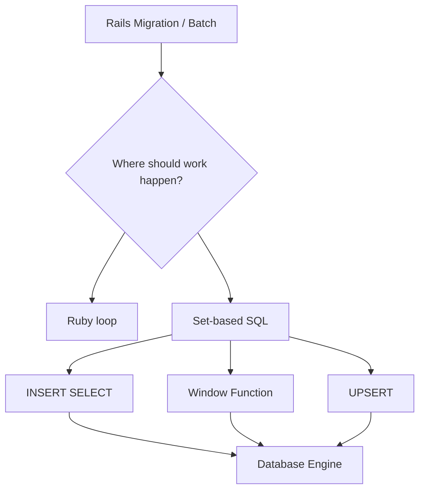

## はじめに

RailsではActiveRecordを使うことで、多くのDB操作をRubyのコードとして書けます。

普段のCRUDであれば、それで十分です。

しかし、Migration、データ移行、バッチ処理、大量更新では、ActiveRecordだけに閉じると遅くなったり、意図が見えにくくなったりします。

このBookでは、生SQLの構文を単発で覚えるのではなく、Railsから見て「どの処理をDBに任せるべきか」という判断軸で再構成します。



## このBookで身につける判断軸

Railsで生SQLを書く目的は、ActiveRecordを避けることではありません。

目的は、処理の責務を正しい場所に置くことです。

- 1件ずつ検証や副作用が必要ならRubyで処理する
- 大量データを同じルールで移すならSQLに寄せる
- グループ内の順位や最新レコード抽出はWindow Functionを使う
- 再実行に強い投入処理はUPSERTを検討する

この判断軸があると、「ActiveRecordで書けるか」ではなく「どこで処理するのが自然か」を考えられます。

## 1. RubyループとSQL集合処理

Railsでデータ移行を書くと、最初に思いつきやすいのはRubyでループする方法です。

```ruby
User.find_each do |user|
  UserProfile.create!(
    email: user.email,
    name: user.name
  )
end
```

この書き方は分かりやすいですが、件数が増えるとDBとの往復が増えます。

また、処理の本質が「usersからuser_profilesへ同じ形で移す」だけなら、Rubyを経由する必要はありません。

その場合は、SQLの集合処理として書けます。

```sql
INSERT INTO user_profiles (
  email,
  name,
  created_at,
  updated_at
)
SELECT
  email,
  name,
  NOW(),
  NOW()
FROM users;
```

これは、`users` の検索結果をまとめて `user_profiles` に投入する処理です。

DB内部で完結するため、Ruby側へ1件ずつデータを戻す必要がありません。

## 2. Railsから実行する

Migrationでは、`execute` を使ってSQLを実行できます。

```ruby
class BackfillUserProfiles < ActiveRecord::Migration[7.2]
  def up
    execute(<<~SQL)
      INSERT INTO user_profiles (
        email,
        name,
        created_at,
        updated_at
      )
      SELECT
        email,
        name,
        NOW(),
        NOW()
      FROM users
    SQL
  end
end
```

`<<~SQL` はRubyのヒアドキュメントです。

複数行のSQLを読みやすく書けるため、Migrationで生SQLを書くときによく使います。

重要なのは、SQLを文字列として埋め込むだけで満足しないことです。

そのSQLがどのテーブルを読み、どの条件で絞り、どれくらいの件数に影響するのかまで確認する必要があります。

## 3. グループ内の最新レコードを取る

実務では、単純な移行だけでなく「ユーザーごとの最新レコードだけ使いたい」という処理もあります。

Rubyで書くと、ユーザーごとにレコードを集めて、更新日時で並べて、先頭を取るような処理になります。

SQLでは、Window Functionを使って表現できます。

```sql
SELECT *
FROM (
  SELECT
    user_events.*,
    ROW_NUMBER() OVER (
      PARTITION BY user_id
      ORDER BY created_at DESC
    ) AS row_num
  FROM user_events
) ranked
WHERE row_num = 1;
```

`PARTITION BY user_id` は、`user_id` ごとに区切るという意味です。

`ORDER BY created_at DESC` は、その区切りの中で新しい順に並べるという意味です。

`ROW_NUMBER()` は、その並びに1から番号を付けます。

そのため、`row_num = 1` だけを残すと、ユーザーごとの最新レコードを取得できます。

## 4. 再実行に強い投入処理

Migrationやバッチ処理では、途中で失敗して再実行することがあります。

そのとき、単純なINSERTだけだと、すでに投入済みの行で重複エラーになることがあります。

MySQLでは、`ON DUPLICATE KEY UPDATE` を使うとUPSERTできます。

```sql
INSERT INTO user_profiles (
  email,
  name,
  updated_at
)
VALUES (
  'alice@example.com',
  'Alice',
  NOW()
)
ON DUPLICATE KEY UPDATE
  name = VALUES(name),
  updated_at = VALUES(updated_at);
```

ここで重複判定に使われるのは、SQL内で指定した任意のキーではありません。

PRIMARY KEYまたはUNIQUE KEYです。

例えば `email` にUNIQUE INDEXがある場合、同じemailが来たときにINSERTではなくUPDATEへ切り替わります。

## 5. 生SQLを書く前に確認すること

Railsから生SQLを書くときは、次の順番で確認すると事故を減らせます。

1. その処理はRubyで1件ずつ扱う必要があるか
2. DB内部で集合処理にできるか
3. 対象件数はどれくらいか
4. 再実行したときに壊れないか
5. IndexやUNIQUE制約は期待通りか
6. 本番データで実行時間が問題にならないか

SQLは強力ですが、強力だからこそ影響範囲も大きくなります。

Migrationでは、事前にSELECTで対象件数を確認し、必要ならトランザクション、ロック、バッチ分割も検討します。

## 6. ActiveRecordとSQLを対立させない

ActiveRecordと生SQLは、どちらが上という関係ではありません。

ActiveRecordは、ドメインロジックや通常のアプリケーション操作に向いています。

一方で、生SQLは、DB内部で完結する大量データ処理や、SQLにしか自然に書けない集合処理に向いています。

Railsで大事なのは、どちらか一方に寄せることではなく、処理の性質に合わせて境界を決めることです。

```text
Validation / Callback / Business Logic
=> Rails / ActiveRecord

Bulk insert / Ranking / Upsert / Data migration
=> SQL / Database Engine
```

## まとめ

Railsで生SQLを書くときは、構文を暗記するよりも、処理をどこで実行するべきかを考えることが重要です。

- 1件ずつの副作用が必要ならRubyで処理する
- 大量データの同型変換はSQL集合処理に寄せる
- 検索結果を投入するなら `INSERT SELECT` を使う
- グループ内の順位付けは `ROW_NUMBER()` を使う
- 再実行に強くしたいならUPSERTを検討する
- 生SQLは実行前に対象件数、制約、Index、再実行性を確認する

この判断軸があると、Railsの中でもDBの力を自然に使えるようになります。
