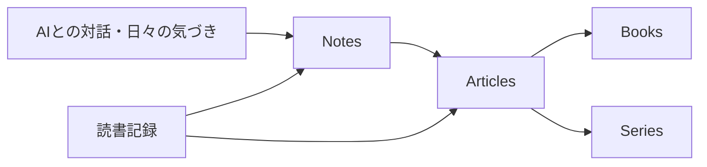

## 概要

Tech Noteは、単なる技術ブログではなく、ポートフォリオと学習記録を兼ねた公開ライブラリとして育てたい。

技術記事だけでなく、読んだ本、英語や韓国語の学習、日々の気づき、学習のコツなども扱えるようにする。

そのために、すべてを「記事」として同じ棚に置くのではなく、役割ごとに分ける。

## コンテンツの分け方

大きくは次の4つに分ける。

- Notes
- Articles
- Books
- Series

Notesは、その日の雑記やAIとの対話から生まれたラフなメモ。

Articlesは、Notesや調査内容を精査して、単体で読めるように整えた記事。

Booksは、複数の記事やメモを寄せ集めるだけではなく、1つの目的を達成するために再構成した長編コンテンツ。

Seriesは、共通テーマの記事をまとめて閲覧できるグループ。

## Notes

Notesは、思考の途中を失わないための場所にする。

AIとの会話で出てきたアイデア、ざっくりした調査、今日考えたこと、まだ確信がない仮説などを残す。

ここでは完成度よりも、あとで再利用できることを優先する。

## Articles

Articlesは、公開記事として読める品質まで整えたものにする。

Notesに書いた内容をそのまま出すのではなく、構成を直し、前提を補い、読者が読み切れる形にする。

技術記事であれば、コード例、図解、内部動作、実行結果などをできるだけ含める。

## Books

Booksは、記事を単に並べたものではない。

ある目的を達成するために、これまでの記事やメモを再構成し、必要であれば新しい章や補足を追加する。

たとえば「Railsで保守性の高いRSpecを書く」というBookであれば、個別の記事をリンクとして参照しつつ、Book本文では順序や説明を作り直す。

Bookは、将来的に課金対象にしても違和感がないレベルまで磨ける余地を持たせる。

## Series

Seriesは、Bookとは別物として扱う。

Seriesは、共通テーマの記事をグループ化するためのもの。

たとえば「世界の拡張子」というSeriesを作り、`.mdx`、`.json`、`.yaml`、`.rb` のように、拡張子ごとの記事をまとめて閲覧できるようにする。

Seriesは本のように本文を再構成する場所ではなく、関連する記事群を辿りやすくするための棚に近い。

## 読書記録

読書記録は、単なる読了ログではなく、学習の接続点として扱う。

技術書、設計、英語、韓国語、キャリア、思考法などを読み、その本から得たことをNotesやArticlesにつなげる。

「読んだ」で終わらせず、どの知識に影響したかを後から辿れるようにする。

## まとめ

Tech Noteのコンテンツは、次の流れで育てる。

ラフな思考をNotesに残し、精査したものをArticlesへ、目的別に再構成したものをBooksへ育てる。

Seriesは、共通テーマの記事を見つけやすくするためのグループとして使う。
