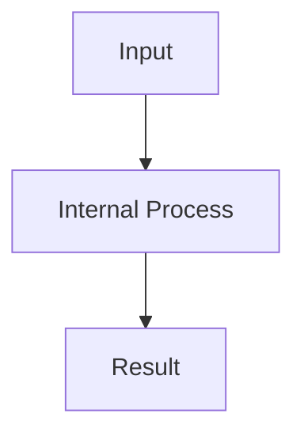

## 概要

この記事で扱うテーマと、なぜ内部動作まで理解する必要があるのかを書く。

## この記事で学べること

- 何を理解できるようになるか
- どの内部構造を扱うか
- 実務でどう判断できるようになるか

## 前提知識

- 必要な基礎知識
- 実行環境
- バージョン差分がある場合は対象バージョン

## 本編

表面的な使い方ではなく、内部実装・アルゴリズム・設計思想から説明する。

## 図解



## SQL例

```sql
CREATE TABLE examples (
  id BIGINT PRIMARY KEY,
  name VARCHAR(255) NOT NULL
);

SELECT *
FROM examples
WHERE id = 1;
```

## EXPLAIN

```sql
EXPLAIN
SELECT *
FROM examples
WHERE id = 1;
```

```text
id | select_type | table    | type  | key     | rows | Extra
---+-------------+----------+-------+---------+------+-------------
1  | SIMPLE      | examples | const | PRIMARY | 1    | NULL
```

## 実際の性能比較

悪い例、改善例、理由、EXPLAIN、結果比較を書く。

## 内部動作

```text
SQL
↓
Parser
↓
Optimizer
↓
Execution Engine
↓
Storage Engine
↓
Result
```

## まとめ

- 覚えるべきポイント
- 暗記ではなく理解すべきこと
- 実務での判断基準

## 参考文献

- 公式ドキュメントや一次情報

